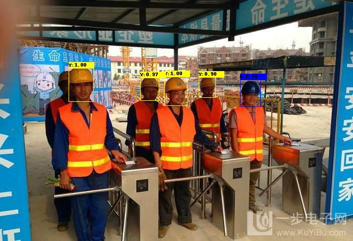
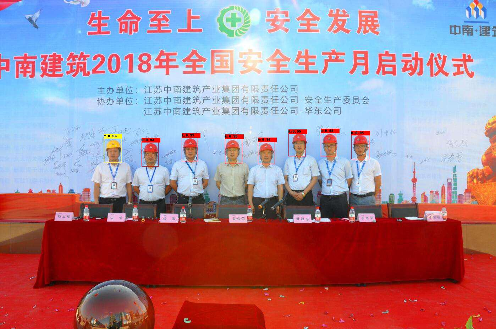

# Helmet Detection on Construction Sites Using SSD Framework

## Requirements
* caffe-ssd
* opencv3 with ssd's layer API (optional for cpp inference, here using opencv3.4.2+vs2013).
## Introduction
This project uses the SSD, one of most famous object detection frameworks, to detect whether a peron wearing the helmet 
and what color the helmet is on construction sites. So far, it's able to detect 4 kind of colors, including red, blue, white
and yellow. Besides, two different kind of models are fine-tuned for detection:

* SSD + VGG16 (original implemention, high accuracy but low efficiency)
* SSD + [Pelee](https://github.com/Robert-JunWang/Pelee) (for more detail, see the ICLR2018 workshop [paper](https://arxiv.org/pdf/1804.06882.pdf))
* SSD + Pelee_38x38 (add 38x38 feature maps for detection, suitable for small objects)

**Note1: For some reasons, this project only provides the model for testing, and in the future we will release the training data.**

**Note2: Although we assure the image preprocessing the same with original caffe, there're slightly differences between 
the opencv3.4.2 and original caffe in ssd implementations. So there may be different performance in cpp and python inference.**
## Preparation
1.Install SSD (https://github.com/weiliu89/caffe/tree/ssd) following the instructions there.

2.Clone this repository

```shell
git clone https://github.com/wujixiu/helmet-detection.git
```
3.Download the models from Google Drive or Baidu Yun and put them in models/vgg or models/pelee respectively.

## Testing
```shell
cd helmet-detection
python ssd_pelee.py
```

## Results





## Models
* VGG16 (97.6M)
* Pelee (20.3M)

[Google Drive](https://drive.google.com/drive/folders/1LPGFCNV4AxQvw32arX0g3lMnhnIgoTlH?usp=sharing)

[Baidu Yun](https://pan.baidu.com/s/1-lFDPdhWF8haUwxXfynX7Q) (pwd:z4k9)


